# vProfile Microservices Application

A production-ready microservices application deployed on AWS using Infrastructure as Code (Terraform), configuration management (Ansible), container orchestration (Kubernetes), and automated CI/CD (Jenkins for CI, Ansible for CD).

## Table of Contents

- [Overview](#overview)
- [Architecture](#architecture)
- [Technology Stack](#technology-stack)
- [Project Structure](#project-structure)
- [Infrastructure Components](#infrastructure-components)
- [Application Components](#application-components)
- [CI/CD Pipeline](#cicd-pipeline)
- [Prerequisites](#prerequisites)
- [Deployment Guide](#deployment-guide)
- [Security Features](#security-features)
- [Monitoring](#monitoring)
- [Troubleshooting](#troubleshooting)

## Overview

The vProfile application is a Java-based web application deployed as microservices on a Kubernetes cluster running on AWS EC2 instances. The infrastructure is fully automated using Terraform for provisioning and Ansible for configuration management. The application uses MySQL for data persistence, RabbitMQ for message queuing, and Tomcat for serving the web application.

### Key Features

- **Infrastructure as Code**: Complete AWS infrastructure provisioned with Terraform
- **Automated Configuration**: Ansible playbooks for Kubernetes cluster setup and application deployment
- **Container Orchestration**: Kubernetes cluster with StatefulSets, Deployments, and Services
- **CI/CD Pipeline**: Jenkins for Continuous Integration (building Docker images), Ansible for Continuous Deployment (deploying to Kubernetes)
- **Security**: Encrypted sensitive data, security groups, private subnets, and IAM roles
- **Monitoring**: Grafana dashboards for cluster and application monitoring
- **High Availability**: Load balancing, auto-scaling, and persistent storage

## Architecture

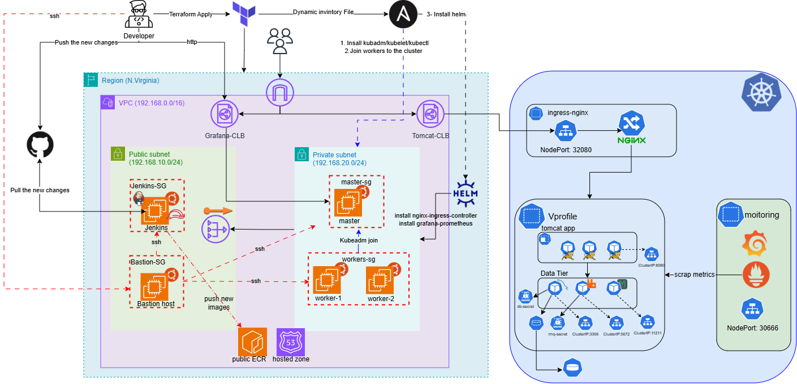

### Architecture Overview

The application follows a three-tier architecture:

1. **CI/CD Layer**: Jenkins (CI) builds Docker images and pushes to AWS ECR; Ansible (CD) deploys applications to Kubernetes
2. **Infrastructure Layer**: AWS resources provisioned by Terraform (VPC, subnets, EC2, Route53, CLB)
3. **Application Layer**: Kubernetes cluster running microservices (MySQL, RabbitMQ, Tomcat)

### Network Architecture

```
Internet
    ↓
Classic Load Balancer (Public Subnet)
    ↓
Nginx Ingress Controller (Kubernetes)
    ↓
Tomcat Service (3 replicas)
    ↓
MySQL StatefulSet + RabbitMQ Deployment
```

## Technology Stack

### Infrastructure & Automation
- **Terraform**: Infrastructure provisioning (v1.0+)
- **Ansible**: Configuration management and application deployment
- **AWS**: Cloud provider (VPC, EC2, Route53, ECR, IAM, CLB)

### Container & Orchestration
- **Docker**: Container runtime
- **Kubernetes**: Container orchestration (kubeadm cluster)
- **Helm**: Kubernetes package manager

### Application Stack
- **Java 11**: Application runtime
- **Maven 3.8.4**: Build tool
- **Tomcat 9.0.75**: Application server
- **MySQL 8.0.44**: Relational database
- **RabbitMQ**: Message broker
- **Nginx**: Ingress controller

### CI/CD & Monitoring
- **Jenkins**: Continuous Integration (build and push Docker images)
- **Ansible**: Continuous Deployment (deploy applications to Kubernetes)
- **Grafana**: Monitoring and visualization
- **Prometheus**: Metrics collection (via Grafana integration)

## Project Structure

```
vProfile-Microservices/
├── terraform/                    # Infrastructure as Code
│   ├── main.tf                  # Root module configuration
│   ├── variables.tf             # Input variables
│   ├── outputs.tf               # Output values
│   ├── provider.tf              # AWS provider configuration
│   ├── ansible_inventory.tf     # Dynamic inventory generation
│   └── modules/
│       ├── 01-vpc/              # VPC and Internet Gateway
│       ├── 02-subnets/          # Public and private subnets
│       ├── 03-natgw-eip/        # NAT Gateway and Elastic IP
│       ├── 04-route_tables/     # Route tables and associations
│       ├── 05-security_groups/  # Security groups for all resources
│       ├── 06-instances/        # EC2 instances (bastion, jenkins, k8s nodes)
│       ├── 07-Route-53/         # Private hosted zone and DNS records
│       ├── 08-ECR/              # Elastic Container Registry
│       ├── 09-iam/              # IAM roles and instance profiles
│       └── 10-CLB/              # Classic Load Balancers (Grafana & Tomcat)
│
├── ansible/                     # Configuration Management
│   ├── ansible.cfg              # Ansible configuration
│   ├── install.yml              # Main playbook
│   ├── inventory/               # Dynamic inventory from Terraform
│   └── roles/
│       ├── k8s-setup/           # Kubernetes cluster installation
│       ├── helm/                # Helm installation & Nginx Ingress
│       ├── grafana/             # Grafana & Prometheus deployment
│       └── vprofile-app/        # Application deployment
│           └── files/           # Kubernetes manifests
│               ├── mysql/       # MySQL manifests (.yml)
│               ├── rabbitmq/    # RabbitMQ manifests (.yml)
│               ├── memcached/   # Memcached manifests (.yml)
│               └── tomcat/      # Tomcat manifests (.yml)
│
├── application-data/            # Application Dockerfiles & Data
│   ├── db/                      # MySQL Docker Image
│   │   ├── Dockerfile           # MySQL image with encrypted backup
│   │   ├── db_backup.sql.enc    # Encrypted database backup
│   │   └── encrypt_db.sh        # Encryption script
│   └── tomcat/                  # Tomcat Docker Image
│       ├── Dockerfile           # Multi-stage build (Maven + Tomcat)
│       ├── application.properties.enc  # Encrypted app configuration
│       └── encrypt_tompapp.sh   # Encryption script
│
├── screenshots/                 # Project screenshots
├── Jenkinsfile                  # CI/CD Pipeline definition
├── deploy.sh                    # Automated deployment script
├── .gitignore                   # Git ignore rules (excludes sensitive files)
└── README.md                    # This file
```

## Infrastructure Components

### AWS Resources (Terraform)

#### 1. VPC Module (`01-vpc`)
- Custom VPC with CIDR block
- Internet Gateway for public internet access
- DNS hostnames and resolution enabled

#### 2. Subnets Module (`02-subnets`)
- **Public Subnet**: Hosts bastion, Jenkins, NAT Gateway, and CLB
- **Private Subnet**: Hosts Kubernetes cluster (master + workers)
- Automatic public IP assignment in public subnet

#### 3. NAT Gateway Module (`03-natgw-eip`)
- Elastic IP for NAT Gateway
- NAT Gateway in public subnet for private subnet internet access

#### 4. Route Tables Module (`04-route_tables`)
- Public route table: Routes to Internet Gateway
- Private route table: Routes to NAT Gateway
- Subnet associations

#### 5. Security Groups Module (`05-security_groups`)
- **Bastion SG**: SSH access from internet
- **Jenkins SG**: HTTP/HTTPS access, SSH from bastion
- **Master SG**: Kubernetes API, etcd, kubelet
- **Worker SG**: NodePort range, kubelet
- **CLB SG**: HTTP/HTTPS from internet

#### 6. Instances Module (`06-instances`)
- **Bastion Host**: Jump server for SSH access (public subnet)
- **Jenkins Server**: CI/CD automation (public subnet)
- **K8s Master**: Kubernetes control plane (private subnet)
- **K8s Workers (2)**: Application workload nodes (private subnet)
- All instances use Ubuntu 22.04 LTS


#### 7. Route53 Module (`07-Route-53`)
- Private hosted zone for internal DNS
- A records for master, workers, and bastion
- Enables service discovery within VPC
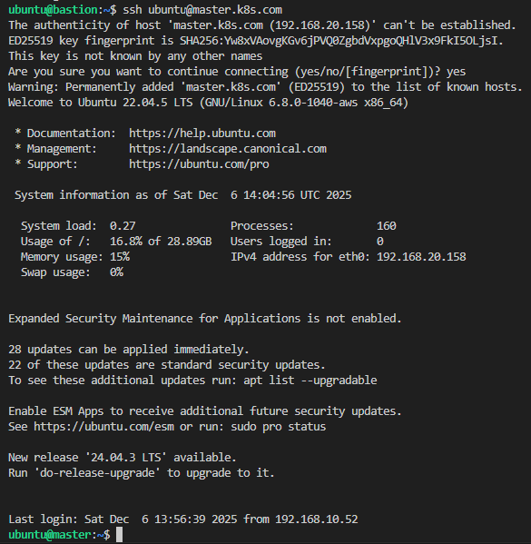

#### 8. ECR Module (`08-ECR`)
- Public ECR repositories for Docker images
- Repositories: `vp-app-db`, `vp-app-tomcat` (`public.ecr.aws/r7l3n7g0`)

#### 9. IAM Module (`09-iam`)
- **Jenkins Role**: ECR push/pull permissions
- **K8s Nodes Role**: ECR pull permissions, CloudWatch logs
- Instance profiles for EC2 instances

#### 10. Classic Load Balancer Module (`10-CLB`)
- Load balancer for Grafana monitoring
- Health checks on NodePort
- Public-facing endpoint
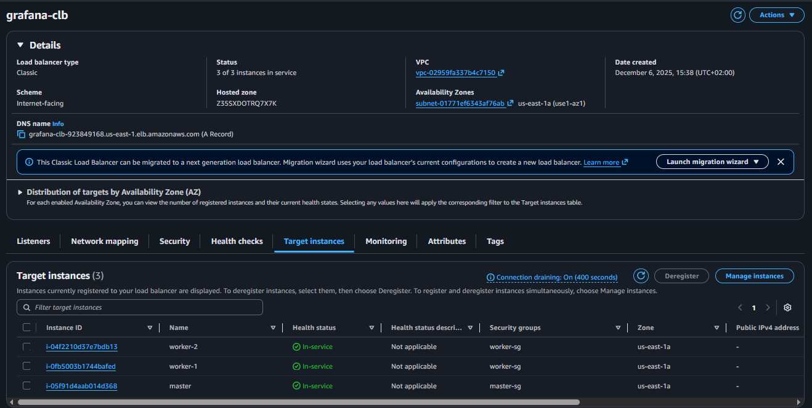
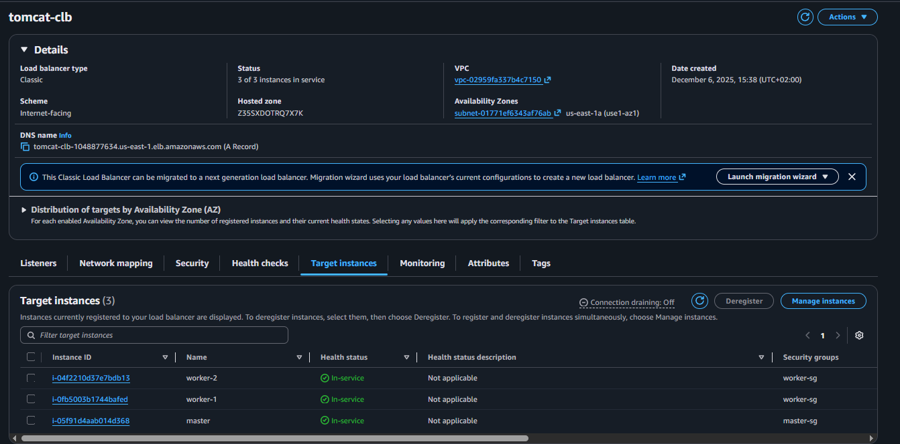

## Application Components

### 1. MySQL Database (StatefulSet)

**Location**: `kubernetes/mysql/`

- **Image**: `public.ecr.aws/r7l3n7g0/vp-app-db`
- **Storage**: PersistentVolume with PersistentVolumeClaim
- **Initialization**: Pre-loaded database backup
- **Security**: Runs as non-root user (UID 1000)
- **Service**: ClusterIP on port 3306 (name: `db01`)

**Features**:
- StatefulSet for stable network identity
- Init container for permission management
- Encrypted database backup in Docker image
- Persistent storage for data durability

### 2. RabbitMQ Message Broker (Deployment)

**Location**: `kubernetes/rabbitmq/`

- **Image**: RabbitMQ official image
- **Replicas**: 1
- **Service**: ClusterIP on port 5672 (AMQP)
- **Purpose**: Asynchronous message processing
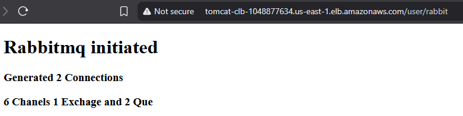

### 3. Tomcat Application Server (Deployment)

**Location**: `kubernetes/tomcat/`

- **Image**: `public.ecr.aws/r7l3n7g0/vp-app-tomcat`
- **Replicas**: 3 (for high availability)
- **Build Process**: Multi-stage Docker build
  1. Maven stage: Clone repo, copy config, build WAR
  2. Tomcat stage: Deploy WAR, configure permissions
- **Service**: ClusterIP on port 8080
- **Ingress**: Nginx Ingress with session affinity
- **Resources**:
  - Requests: 250m CPU, 512Mi memory
  - Limits: 500m CPU, 1Gi memory

**Ingress Configuration**:
- Path: `/`
- Session affinity with cookie-based routing
- Cookie name: `INGRESSCOOKIE`
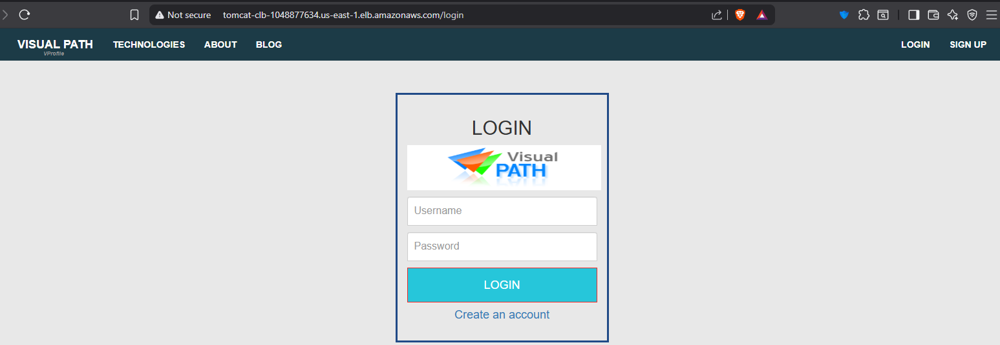
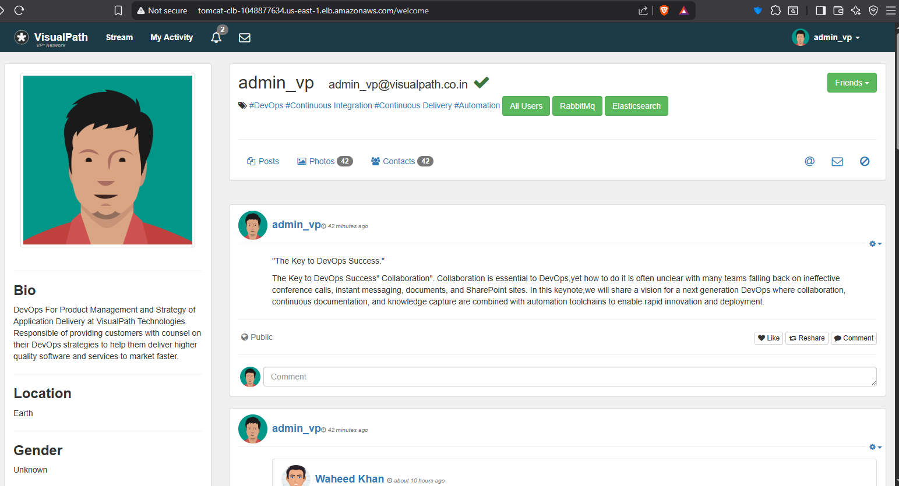

### 4. Nginx Ingress Controller

- **Deployment**: Via Helm chart
- **NodePorts**: Fixed ports for CLB integration
  - HTTP: 32080
  - HTTPS: 32443
- **Purpose**: Route external traffic to services

### 5. Grafana Monitoring

- **Deployment**: Via Ansible role
- **Access**: Through Classic Load Balancer
- **Purpose**: Cluster and application monitoring
- **Integration**: Prometheus metrics

## CI/CD Pipeline

### Overview

The project implements a complete CI/CD pipeline:

- **CI (Continuous Integration)**: Jenkins builds Docker images and pushes them to AWS ECR
- **CD (Continuous Deployment)**: Ansible deploys applications to the Kubernetes cluster

### Jenkins Pipeline (CI)

**File**: `Jenkinsfile`

The Jenkins pipeline automates the **Continuous Integration** process by building Docker images and pushing them to AWS ECR.

### Pipeline Stages

#### 1. Checkout Code
```groovy
git branch: "vProfile-Microservices", url: "https://github.com/Omarh4700/vProfile-Microservices.git"
```
- Clones the application source code from GitHub

#### 2. Get Git SHA
- Generates short commit SHA for image tagging
- Ensures traceability of deployments

#### 3. Login to Public ECR
```bash
aws ecr-public get-login-password --region us-east-1 | docker login --username AWS --password-stdin public.ecr.aws/r7l3n7g0
```
- Authenticates with AWS ECR using IAM credentials

#### 4. Decrypt DB Backup
- Retrieves encryption key from Jenkins credentials
- Decrypts `db_backup.sql.enc` using OpenSSL AES-256-CBC
- Validates successful decryption

#### 5. Build & Push DB Image
```bash
docker build -t ${ECR_DB}:${GIT_SHA} -t ${ECR_DB}:latest .
docker push ${ECR_DB}:${GIT_SHA}
docker push ${ECR_DB}:latest
```
- Builds MySQL image with decrypted backup
- Tags with commit SHA and latest
- Pushes to ECR

#### 6. Decrypt Tomcat App Config
- Decrypts `application.properties.enc`
- Contains database connection strings and app settings

#### 7. Build & Push Tomcat Image
- Multi-stage build:
  1. Maven: Builds WAR file with decrypted config
  2. Tomcat: Deploys WAR as ROOT application
- Pushes to ECR with versioning

#### 8. Post Actions
- **Always**:
  - Removes decrypted files for security
  - Logs out from ECR
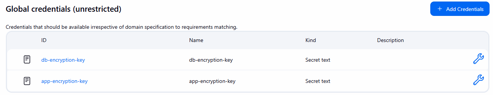
  - Cleans up local Docker images
- **Success**: Logs image tags
- **Failure**: Logs error message

### Ansible Deployment (CD)

**File**: `ansible/install.yml`

Ansible handles the **Continuous Deployment** process by:

1. **Kubernetes Cluster Setup** (`k8s-setup` role):
   - Installs kubeadm, kubelet, kubectl
   - Initializes master node
   - Joins worker nodes to cluster

2. **Helm Installation** (`helm` role):
   - Installs Helm package manager
   - Deploys Nginx Ingress Controller

3. **Grafana Deployment** (`grafana` role):
   - Deploys Grafana for monitoring
   - Configures dashboards and data sources

4. **Application Deployment** (`vprofile-app` role):
   - Deploys MySQL StatefulSet with persistent storage
   - Deploys RabbitMQ Deployment
   - Deploys Tomcat Deployment (3 replicas)
   - Configures Services and Ingress

**Deployment Workflow**:
```bash
# After Jenkins builds and pushes images to ECR
# Ansible pulls the latest images and deploys to Kubernetes
ansible-playbook install.yml
```

### Security in CI/CD

**CI Security (Jenkins)**:
1. **Encrypted Secrets**: Database backups and app configs encrypted at rest
2. **Jenkins Credentials**: Encryption keys stored in Jenkins credential store
3. **Ephemeral Decryption**: Files decrypted only during build, deleted after
4. **IAM Roles**: Jenkins uses IAM instance profile for ECR access
5. **Image Scanning**: ECR can be configured for vulnerability scanning

**CD Security (Ansible)**:
1. **SSH Key Authentication**: Secure access to Kubernetes nodes
2. **Ansible Vault**: Can encrypt sensitive playbook variables
3. **Least Privilege**: Ansible runs with minimal required permissions
4. **Idempotent Deployments**: Safe to run multiple times

## Prerequisites

### Local Machine Requirements

- **Terraform**: v1.0 or higher
- **Ansible**: v2.9 or higher
- **AWS CLI**: v2.x configured with credentials
- **SSH Key**: For accessing EC2 instances
- **Git**: For cloning repository

### AWS Account Requirements

- AWS account with appropriate permissions
- IAM user with permissions for:
  - EC2, VPC, Route53, ECR, IAM, ELB
- AWS credentials configured (`~/.aws/credentials`)

### Domain (Optional)

- Route53 hosted zone for custom domain
- Or use AWS-provided DNS names

## Deployment Guide

### Quick Start (Automated)

```bash
# Clone the repository
git clone -b vProfile-Microservices https://github.com/Omarh4700/Workshop.git
cd Workshop

# Run automated deployment
./deploy.sh
```

> **Want to see the magic happen?**  
> Simply run `./deploy.sh` and watch as the entire infrastructure provisions itself and the application deploys automatically! This single command orchestrates Terraform and Ansible to build your complete cloud environment.

The `deploy.sh` script will:
1. **Provision Infrastructure**: Initialize and apply Terraform configuration
2. **Deploy Applications**: Run Ansible playbooks to:
   - Configure Kubernetes cluster
   - Deploy all application components (MySQL, RabbitMQ, Tomcat)
   - Set up monitoring with Grafana

### Manual Deployment

#### Step 1: Provision Infrastructure with Terraform

```bash
cd terraform

# Initialize Terraform
terraform init

# Review planned changes
terraform plan

# Apply configuration
terraform apply -auto-approve

# Note the outputs (bastion IP, Jenkins IP, etc.)
terraform output
```

**Expected Resources**:
- 1 VPC with public and private subnets
- 1 NAT Gateway with Elastic IP
- 5 EC2 instances (bastion, jenkins, master, 2 workers)
- Security groups for all components
- Route53 private hosted zone
- ECR repositories
- IAM roles and instance profiles
- Classic Load Balancer

#### Step 2: Configure SSH Access

```bash
# Copy the generated SSH key
cp terraform/bastion-key.pem ~/.ssh/
chmod 400 ~/.ssh/bastion-key.pem

# SSH to bastion host
ssh -i ~/.ssh/bastion-key.pem ubuntu@<bastion-public-ip>

# From bastion, SSH to private instances
ssh ubuntu@<master-private-ip>
```

#### Step 3: Deploy Kubernetes Cluster with Ansible

```bash
cd ansible

# Verify inventory
cat inventory/hosts

# Run the playbook
ansible-playbook install.yml

# Playbook will:
# - Install and configure Kubernetes (kubeadm, kubelet, kubectl)
# - Initialize master node
# - Join worker nodes to cluster
# - Install Helm
# - Deploy Grafana
# - Deploy vProfile application
```

#### Step 4: Verify Kubernetes Cluster

```bash
# SSH to master node
ssh ubuntu@<master-private-ip>

# Check cluster status
kubectl get nodes
kubectl get pods -A

# Expected output:
# - 3 nodes (1 master, 2 workers) in Ready state
# - All system pods running in kube-system namespace
```

#### Step 5: Deploy Application Components

The Ansible playbook automatically deploys the application, but you can also deploy manually:

```bash
# SSH to master node
cd /path/to/kubernetes

# Deploy MySQL
kubectl apply -f mysql/db-pv.yaml
kubectl apply -f mysql/db-pvc.yaml
kubectl apply -f mysql/db-statefulset.yaml
kubectl apply -f mysql/db-service.yaml

# Deploy RabbitMQ
kubectl apply -f rabbitmq/rmq-edploy.yaml
kubectl apply -f rabbitmq/rmq-service.yaml

# Deploy Tomcat
kubectl apply -f tomcat/tomcat-deployment.yaml
kubectl apply -f tomcat/tomcat-service.yaml
kubectl apply -f tomcat/tomcat-ingress.yaml

# Verify deployments
kubectl get pods -n vprofile
kubectl get svc -n vprofile
kubectl get ingress -n vprofile
```

#### Step 6: Configure Jenkins (CI)

```bash
# Access Jenkins
http://<jenkins-public-ip>:8080

# Configure Jenkins:
# 1. Install required plugins: Docker, AWS ECR, Git
# 2. Add credentials:
#    - db-encryption-key: Database backup encryption key
#    - app-encryption-key: Application config encryption key
# 3. Create pipeline job pointing to Jenkinsfile
# 4. Run the pipeline to build and push Docker images
```

**Note**: Jenkins handles CI (building images). Ansible (run in Step 3) handles CD (deploying to Kubernetes).

#### Step 7: Access the Application

```bash
# Get the Load Balancer DNS
terraform output clb_dns_name

# Access Grafana
http://<clb-dns-name>

# Access Tomcat application
# Get Ingress external IP
kubectl get ingress -n vprofile

# Access application
http://<ingress-ip>/login
```

**Application Demo**:
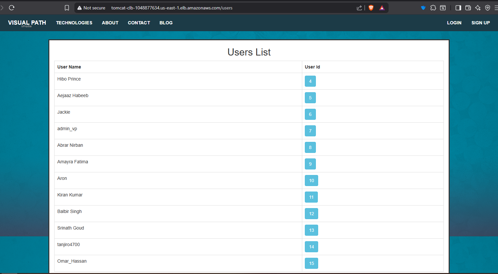


### Encryption Setup

#### Encrypt Database Backup

```bash
cd ./application-data/db

# Create encryption key (save this securely!)
export DB_ENCRYPTION_KEY="your-secure-key-here"

# Encrypt the backup
./encrypt_db.sh

# Add key to Jenkins credentials as 'db-encryption-key'
```

#### Encrypt Application Configuration

```bash
cd ./application-data/tomcat

# Create encryption key (save this securely!)
export APP_ENCRYPTION_KEY="your-secure-key-here"

# Encrypt the properties file
./encrypt_tompapp.sh

# Add key to Jenkins credentials as 'app-encryption-key'
```

## Security Features

### Network Security

1. **VPC Isolation**: Custom VPC with controlled ingress/egress
2. **Private Subnets**: Kubernetes cluster in private subnet (no direct internet access)
3. **Bastion Host**: Single entry point for SSH access
4. **Security Groups**: Least privilege access control
5. **NAT Gateway**: Outbound internet for private instances

### Application Security

1. **Encrypted Secrets**: Database backups and configs encrypted with AES-256-CBC
2. **Non-root Containers**: All containers run as non-root users (UID 1000)
3. **IAM Roles**: Instance profiles instead of hardcoded credentials
4. **Network Policies**: Kubernetes network policies for pod-to-pod communication
5. **Ingress TLS**: Can be configured for HTTPS termination

### Access Control

1. **SSH Key-based Authentication**: No password authentication
2. **Jenkins Credentials**: Encrypted credential storage
3. **ECR Private Repositories**: Can be configured for private access
4. **RBAC**: Kubernetes Role-Based Access Control

## Monitoring

### Grafana Dashboards

Access Grafana through the Classic Load Balancer:
**Default Credentials**:
- **Username**: `admin`
- **Password**: Retrieve from Kubernetes secret:
  ```bash
  kubectl get secret --namespace monitoring monitoring-grafana -o jsonpath="{.data.admin-password}" | base64 --decode ; echo
  ```

```
http://<clb-dns-name>
```

**Available Dashboards**:
- Kubernetes cluster metrics
- Node resource utilization
- Pod performance
- Application metrics
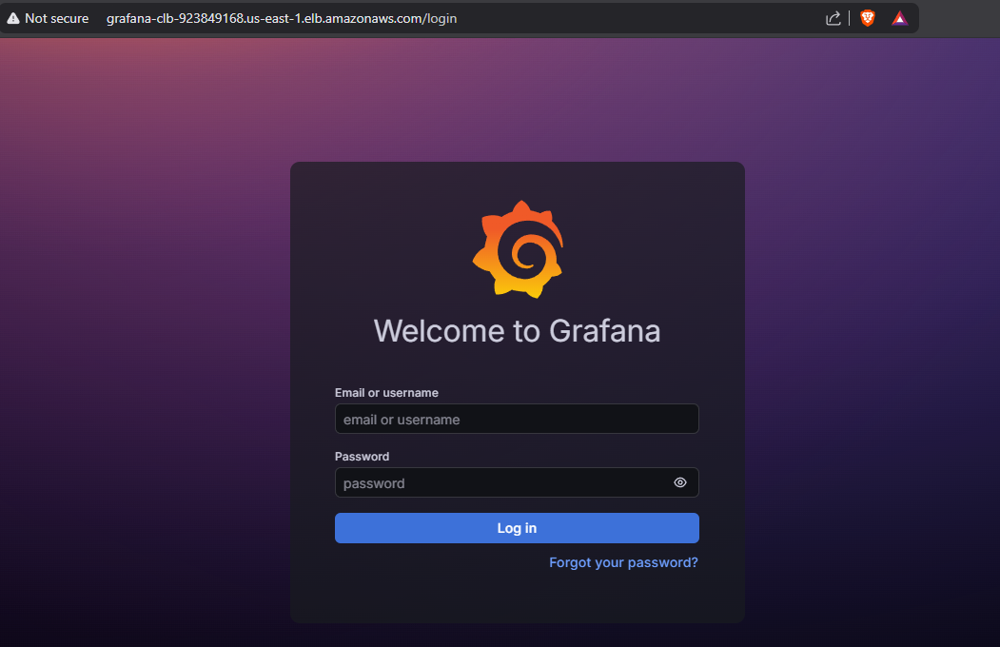

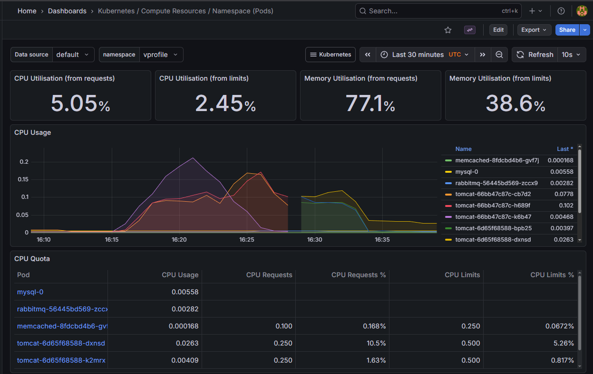

### Kubernetes Monitoring

```bash
# Check pod status
kubectl get pods -A

# View pod logs
kubectl logs -n vprofile <pod-name>

# Describe resources
kubectl describe pod -n vprofile <pod-name>

# Check events
kubectl get events -n vprofile --sort-by='.lastTimestamp'
```

### Application Health Checks

```bash
# Check MySQL
kubectl exec -it -n vprofile mysql-0 -- mysql -u root -p

# Check RabbitMQ
kubectl exec -it -n vprofile <rabbitmq-pod> -- rabbitmqctl status

# Check Tomcat
kubectl exec -it -n vprofile <tomcat-pod> -- curl localhost:8080/login
```

## Troubleshooting

### Common Issues

#### 1. Terraform Apply Fails

**Issue**: Resource creation errors

**Solution**:
```bash
# Check AWS credentials
aws sts get-caller-identity

# Verify region
cat terraform/variables.tf

# Check for resource limits
aws service-quotas list-service-quotas --service-code ec2
```

#### 2. Ansible Playbook Fails

**Issue**: Cannot connect to hosts

**Solution**:
```bash
# Verify inventory
cat ansible/inventory/hosts

# Test connectivity
ansible all -m ping

# Check SSH key permissions
chmod 400 ~/.ssh/bastion-key.pem
```

#### 3. Kubernetes Nodes Not Ready

**Issue**: Nodes in NotReady state

**Solution**:
```bash
# Check node status
kubectl get nodes
kubectl describe node <node-name>

# Check kubelet service
sudo systemctl status kubelet

# Check container runtime
sudo systemctl status containerd

# Restart kubelet
sudo systemctl restart kubelet
```

#### 4. Pods in CrashLoopBackOff

**Issue**: Application pods failing

**Solution**:
```bash
# Check pod logs
kubectl logs -n vprofile <pod-name>

# Check pod events
kubectl describe pod -n vprofile <pod-name>

# Check resource constraints
kubectl top pods -n vprofile

# Verify images are pulled
kubectl get pods -n vprofile -o jsonpath='{.items[*].status.containerStatuses[*].image}'
```

#### 5. Cannot Access Application

**Issue**: Application not reachable

**Solution**:
```bash
# Check ingress
kubectl get ingress -n vprofile
kubectl describe ingress -n vprofile tomcat-ingress

# Check services
kubectl get svc -n vprofile

# Check CLB health
aws elb describe-instance-health --load-balancer-name grafana-clb

# Verify security groups
# Ensure CLB SG allows HTTP/HTTPS from 0.0.0.0/0
# Ensure worker SG allows NodePort range from CLB SG
```

#### 6. Jenkins Pipeline Fails

**Issue**: Build or push errors

**Solution**:
```bash
# Verify ECR login
aws ecr-public get-login-password --region us-east-1

# Check Jenkins credentials
# Ensure 'db-encryption-key' and 'app-encryption-key' are set

# Verify IAM role
aws sts get-caller-identity

# Check Docker daemon
sudo systemctl status docker
```

### Logs and Debugging

```bash
# Terraform logs
export TF_LOG=DEBUG
terraform apply

# Ansible verbose mode
ansible-playbook install.yml -vvv

# Kubernetes logs
kubectl logs -n kube-system <pod-name>

# Container logs
docker logs <container-id>

# System logs
sudo journalctl -u kubelet -f
sudo journalctl -u containerd -f
```


## Additional Notes

### Cleanup

To destroy all resources:

```bash
# Destroy Terraform resources
cd terraform
terraform destroy -auto-approve

# This will remove:
# - All EC2 instances
# - VPC and networking components
# - Security groups
# - Route53 records
# - IAM roles
# - Load balancers
```

### Cost Optimization

- Use spot instances for non-production environments
- Schedule instances to stop during non-business hours
- Use smaller instance types for testing
- Enable ECR lifecycle policies to remove old images

### Scaling

**Horizontal Pod Autoscaling**:
```bash
kubectl autoscale deployment tomcat -n vprofile --cpu-percent=70 --min=3 --max=10
```

**Cluster Autoscaling**:
- Add more worker nodes via Terraform
- Update Ansible inventory
- Run Ansible playbook to join new nodes

### Backup and Recovery

**Database Backups**:
```bash
# Manual backup
kubectl exec -n vprofile mysql-0 -- mysqldump -u root -p<password> <database> > backup.sql

# Automated backups via CronJob (recommended)
```

**Disaster Recovery**:
- Store Terraform state in S3 with versioning
- Backup Kubernetes manifests in Git
- Regular snapshots of EBS volumes
- Document recovery procedures

## Contributing

1. Fork the repository
2. Create a feature branch
3. Make your changes
4. Test thoroughly
5. Submit a pull request

## License

This project is licensed under the MIT License.

## CONTRIBUTORS

| Name                 | GitHub Profile |
|----------------------|----------------|
| **Omar Hassan**      | [Omarh4700](https://github.com/Omarh4700) |
| **Mohamed Abdelsattar** | [mohamedbstar413](https://github.com/mohamedbstar413) |
| **Amr Adel**         | [amrAdel-1](https://github.com/amrAdel-1) |
| **Amr Elhady**       | [Amrelhady288](https://github.com/Amrelhady288) |
| **Ahmed Khaledd**    | [A7medo-O](https://github.com/A7medo-O) |
| **Salah Sleem**     | [SalahSleem](https://github.com/SalahSleem) |


## Acknowledgments

- Kubernetes community for excellent documentation
- HashiCorp for Terraform
- Red Hat for Ansible
- AWS for cloud infrastructure

---

**Last Updated**: December 2025

For questions or issues, please open an issue in the repository.
