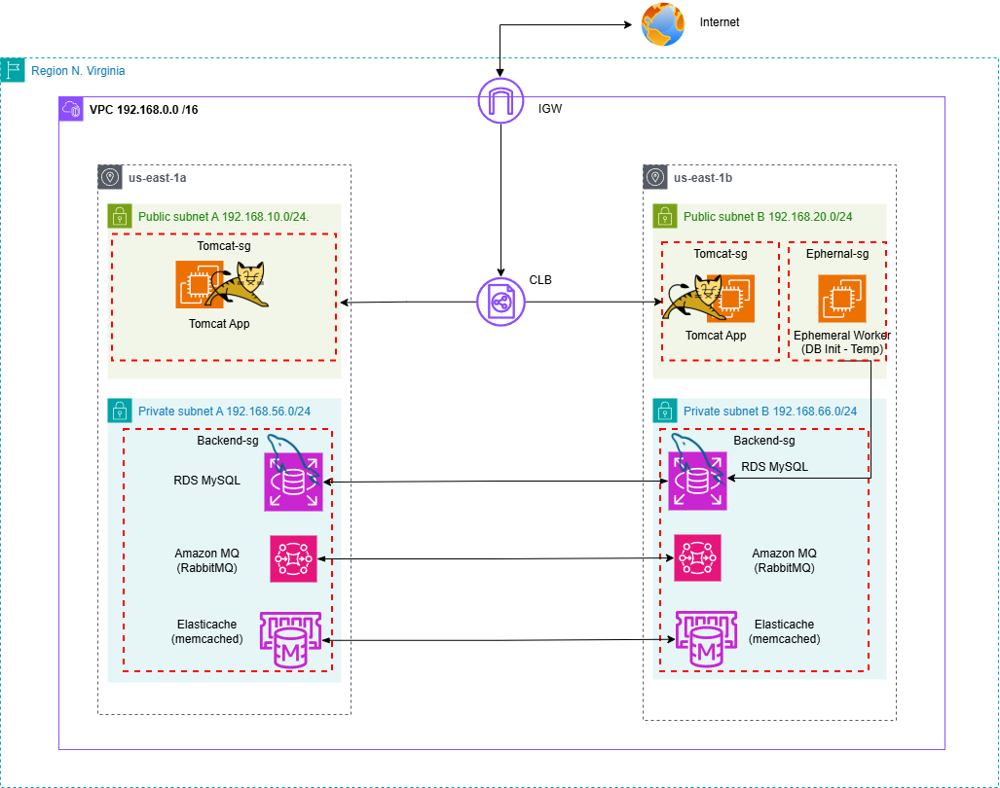

# vProfile App - AWS Infrastructure with Terraform

A complete Infrastructure as Code (IaC) solution for deploying the vProfile application on AWS using Terraform. This project provisions a highly available, secure, and scalable multi-tier architecture with automated database initialization and application deployment.

---

## Table of Contents

- [Architecture Overview](#architecture-overview)
- [Infrastructure Components](#infrastructure-components)
- [Prerequisites](#prerequisites)
- [Quick Start](#quick-start)
- [Project Structure](#project-structure)
- [Module Details](#module-details)
- [Security Configuration](#security-configuration)
- [Outputs](#outputs)
- [Cost Optimization](#cost-optimization)
- [Troubleshooting](#troubleshooting)

---

## Architecture Overview

This infrastructure deploys a highly available three-tier architecture across two Availability Zones in AWS:



**Flow**:

┌─────┐

│   CLB   = Load Balancer (distributes traffic to Tomcat)

└─────┘

**Public Subnets**  = Internet-accessible (Tomcat in A, Ephemeral Worker in B)
**Private Subnets** = No direct internet access (Backend services)

**Data Flow**:
Internet → CLB → Tomcat (Subnet A) → Backend Services (Private Subnets)
Ephemeral Worker (Subnet B) → RDS (initializes database, then terminates)

**High Availability**:
- All backend services (RDS, ElastiCache, Amazon MQ) span both AZs
- CLB distributes traffic across both availability zones

### Key Features

**High Availability**: Multi-AZ deployment for critical services
**Security**: Layered security groups with least privilege access
**Automation**: Automated database initialization and application deployment
**Scalability**: Load-balanced application tier
**Modularity**: Reusable Terraform modules for each component

---

## Infrastructure Components

### Network Layer
- **VPC**: Custom VPC with DNS support and hostnames enabled
- **Subnets**: 2 Public + 2 Private subnets across 2 Availability Zones
- **Internet Gateway**: For public internet access
- **Route Tables**: Separate routing for public and private subnets

### Data Layer
| Service | Purpose | Configuration |
|---------|---------|---------------|
| **Amazon RDS**   | MySQL Database | Single-AZ, Private subnet, Automated backups |
| **ElastiCache**  | Memcached Caching | Multi-node cluster, Private subnet |
| **Amazon MQ**    | RabbitMQ Message Broker | Single-instance, Private subnet |

### Application Layer
| Component | Purpose | Details |
|-----------|---------|---------|
| **Tomcat Instance** | Application Server | Public subnet, Auto-configured with backend endpoints |
| **Ephemeral Worker** | Database Initialization | Temporary instance, Auto-terminates after setup |
| **Classic Load Balancer** | Traffic Distribution | HTTP (80) → Tomcat (8080), Health checks enabled |

### Security Layer
- **4 Security Groups**: CLB, Tomcat, Ephemeral Worker, Backend Services
- **Granular Rules**: Port-specific ingress/egress rules
- **SSH Key Pair**: Auto-generated RSA 4096-bit key pair

---

## Prerequisites

Before deploying this infrastructure, ensure you have:

### Required Tools
- **Terraform** >= 1.0.0 ([Download](https://www.terraform.io/downloads))
- **AWS CLI** >= 2.0 ([Download](https://aws.amazon.com/cli/))
- **Git** (for cloning the repository)

### AWS Requirements
- AWS Account with appropriate permissions
- AWS CLI configured with credentials:
  ```bash
  aws configure
  ```
- Sufficient service quotas for:
  - VPCs (1)
  - EC2 Instances (2)
  - RDS Instances (1)
  - ElastiCache Clusters (1)
  - Amazon MQ Brokers (1)

---

## Quick Start

### 1. Clone the Repository
```bash
git clone -b aws-terraform https://github.com/Omarh4700/Workshop.git
cd Workshop/
```

### 2. Review and Customize Variables
Edit `variables.tf` to customize:
```hcl
variable "admin_cidr_blocks" {
  default = ["YOUR_IP/32"]  # Replace with your IP for security
}
```

### 3. Initialize Terraform
```bash
terraform init
```

### 4. Preview the Infrastructure
```bash
terraform plan
```

### 5. Deploy the Infrastructure
```bash
terraform apply -auto-approve
```

**Note**: The deployment process may take up to 10 minutes.


### 6. Access Your Application
After deployment completes, get the Load Balancer URL:
```bash
terraform output clb_dns_name
```

Access the application:
```
http://<CLB-DNS-NAME>/login
```

### 7. Retrieve SSH Key
The private key is saved locally:
```bash
ssh -i vp-app_key.pem ubuntu@<instance-public-ip>
```

---

## Project Structure

```
vpApp-aws-terraform/
├── main.tf                          # Root module orchestration
├── variables.tf                     # Global variables
├── README.md                        # Project documentation
├── project-diagram.png              # Project diagram
├── provider.tf                      # AWS provider configuration
├── vp-app_key.pem                   # Auto-generated SSH key (gitignored)
│
└── modules/
    ├── 01_vpc/                      # VPC and Internet Gateway
    │   ├── main.tf
    │   ├── variables.tf
    │   └── output.tf
    │
    ├── 02_subnets/                  # Public and Private Subnets
    │   ├── main.tf
    │   ├── variables.tf
    │   └── output.tf
    │
    ├── 03_route-table/              # Route Tables and Associations
    │   ├── main.tf
    │   ├── variables.tf
    │   └── output.tf
    │
    ├── 04-security_group/           # All Security Groups and Rules
    │   ├── main.tf                  # 295 lines of security rules
    │   ├── variables.tf
    │   └── output.tf
    │
    ├── 05-RDS/                      # RDS MySQL Database
    │   ├── main.tf
    │   ├── variables.tf
    │   ├── output.tf
    │   ├── Parameter-groups/        # DB Parameter Group
    │   └── Subnet-groups/           # DB Subnet Group
    │
    ├── 06_ElastiCache/              # ElastiCache Memcached
    │   ├── main.tf
    │   ├── variables.tf
    │   ├── output.tf
    │   ├── Parameter-groups/        # Cache Parameter Group
    │   └── Subnet-groups/           # Cache Subnet Group
    │
    ├── 07_Amazon MQ/                # Amazon MQ RabbitMQ Broker
    │   ├── main.tf
    │   ├── variables.tf
    │   └── output.tf
    │
    ├── 08_instances/                # EC2 Instances
    │   ├── main.tf
    │   ├── variables.tf
    │   ├── output.tf
    │   ├── userdata.sh              # Tomcat initialization script
    │   └── worker_userdata.tftpl    # Database initialization template
    │
    └── 09_CLB/                      # Classic Load Balancer
        ├── main.tf
        ├── variable.tf
        └── output.tf
```

---

## Module Details

### Module 01: VPC
**Purpose**: Creates the foundational network infrastructure

**Resources**:
- VPC with CIDR block (configurable)
- DNS support and hostnames enabled
- Internet Gateway for public internet access

**Outputs**: `vpc_id`, `internet_gateway_id`

---

### Module 02: Subnets
**Purpose**: Creates public and private subnets across two Availability Zones

**Resources**:
- 2 Public Subnets (AZ-A, AZ-B) - Auto-assign public IPs
- 2 Private Subnets (AZ-A, AZ-B) - No public IPs

**Outputs**: `public_subnet-A-id`, `public_subnet-B-id`, `private_subnet-A-id`, `private_subnet-B-id`

---

### Module 03: Route Tables
**Purpose**: Configures routing for public and private subnets

**Resources**:
- **Public Route Table**: Routes `0.0.0.0/0` to Internet Gateway
- **Private Route Table**: Local VPC routing only
- Route table associations for all subnets

---

### Module 04: Security Groups
**Purpose**: Implements network security with granular firewall rules

**Security Groups**:
1. **CLB Security Group** (`clb-sg`)
   - Ingress: HTTP (80) from anywhere
   - Egress: HTTP (80, 8080) to Tomcat

2. **Tomcat Security Group** (`tomcat-sg`)
   - Ingress: HTTP (80, 8080) from CLB, SSH (22) from Ephemeral Worker
   - Egress: MySQL (3306), Memcached (11211), RabbitMQ (5671) to Backend

3. **Ephemeral Worker Security Group** (`ephemeral_worker-sg`)
   - Ingress: SSH (22) from admin CIDR, HTTP (80) for updates
   - Egress: HTTP/HTTPS for updates, SSH to Tomcat, MySQL to Backend

4. **Backend Security Group** (`backend_vp_app_sg`)
   - Ingress: MySQL (3306), Memcached (11211), RabbitMQ (5671) from Tomcat/Worker
   - Egress: HTTP (8080) to Tomcat

**Total Rules**: 25+ granular security rules

---

### Module 05: RDS
**Purpose**: Provisions MySQL database for application data

**Components**:
- **RDS Instance**: MySQL engine, configurable instance class
- **Parameter Group**: Custom MySQL parameters
- **Subnet Group**: Private subnet placement

**Configuration**:
- Engine: MySQL
- Multi-AZ: Disabled (single-AZ for cost optimization)
- Public Access: Disabled
- Automated Backups: Enabled

**Outputs**: `RDS_Endpoint`, `RDS_Address`, `username`, `password`

---

### Module 06: ElastiCache
**Purpose**: Provides Memcached caching layer for application performance

**Components**:
- **ElastiCache Cluster**: Memcached engine
- **Parameter Group**: Cache configuration
- **Subnet Group**: Private subnet placement

**Configuration**:
- Engine: Memcached
- Node Type: Configurable
- Number of Nodes: Configurable

**Outputs**: `ElastiCache_Endpoint`

---

### Module 07: Amazon MQ
**Purpose**: Deploys RabbitMQ message broker for asynchronous messaging

**Configuration**:
- Engine: RabbitMQ
- Deployment Mode: Single-instance
- Public Access: Disabled
- Auto Minor Version Upgrade: Enabled

**Outputs**: `RabbitMQ_broker_endpoint`, `Amazon-MQ-username`, `Amazon-MQ-password`

---

### Module 08: Instances
**Purpose**: Launches and configures EC2 instances

**Resources**:
1. **TLS Private Key**: Auto-generated RSA 4096-bit key
2. **AWS Key Pair**: For SSH access
3. **Ephemeral Worker Instance**:
   - Purpose: Initialize database schema
   - Lifecycle: Auto-terminates after completion
   - User Data: Runs database initialization script
4. **Tomcat Instance**:
   - Purpose: Application server
   - User Data: Configures Tomcat with backend endpoints
   - Public IP: Enabled

**User Data Scripts**:
- `worker_userdata.tftpl`: Database initialization
- `userdata.sh`: Tomcat configuration with RDS, ElastiCache, and RabbitMQ endpoints

**Outputs**: `tomcat_instance_id`, `tomcat_public_ip`

---

### Module 09: Classic Load Balancer
**Purpose**: Distributes HTTP traffic to Tomcat instances

**Configuration**:
- Listener: HTTP (80) → Instance HTTP (8080)
- Health Check: `HTTP:8080/login`
  - Healthy Threshold: 2
  - Unhealthy Threshold: 2
  - Timeout: 3 seconds
  - Interval: 30 seconds
- Cross-Zone Load Balancing: Enabled

**Outputs**: `clb_dns_name`

---

## Security Configuration

### Network Security
- **Private Subnets**: All backend services (RDS, ElastiCache, Amazon MQ) are in private subnets
- **No Public Access**: Database and cache services are not publicly accessible
- **Security Group Isolation**: Each tier has dedicated security groups

### Access Control
| Service | Allowed Sources | Ports |
|---------|----------------|-------|
| CLB | Internet (0.0.0.0/0) | 80 |
| Tomcat | CLB, Ephemeral Worker | 8080, 22 |
| RDS | Tomcat, Ephemeral Worker | 3306 |
| ElastiCache | Tomcat | 11211 |
| Amazon MQ | Tomcat | 5671 |
| Ephemeral Worker | Admin CIDR | 22 |

### Best Practices Implemented
Principle of least privilege  
No hardcoded credentials (use Terraform outputs)  
SSH key auto-generation  
Security group rules instead of CIDR-based access  
Private subnet placement for data layer  

### Security Recommendations

> [!WARNING]
> **Before Production Deployment**:
> 1. Change `admin_cidr_blocks` from `0.0.0.0/0` to your specific IP
> 2. Enable Multi-AZ for RDS
> 3. Enable encryption at rest for RDS and ElastiCache
> 4. Implement AWS Secrets Manager for credentials
> 5. Enable VPC Flow Logs
> 6. Configure AWS CloudTrail for audit logging

---

## Outputs

After successful deployment, Terraform provides the following outputs:

```bash
# View all outputs
terraform output

# Specific outputs
terraform output clb_dns_name           # Load Balancer URL
terraform output tomcat_public_ip       # Tomcat instance IP
terraform output rds_endpoint           # Database endpoint
terraform output elasticache_endpoint   # Cache endpoint
terraform output rabbitmq_endpoint      # Message broker endpoint
```

### Key Outputs
- **CLB DNS Name**: Access your application via HTTP
- **RDS Endpoint**: Database connection string
- **ElastiCache Endpoint**: Cache connection string
- **RabbitMQ Endpoint**: Message broker connection string
- **Database Credentials**: Username and password (sensitive)

---

## Cost Optimization

### Estimated Monthly Cost
> [!NOTE]
> **AWS Free Tier Eligible** (for new AWS accounts within first 12 months):
> - EC2 Instance - Ephemeral Worker (t2.micro × 1): **FREE** (750 hours/month included)
> - EC2 Instance - Tomcat App (t3.large × 1): **~$60/month** (not Free Tier eligible)
> - RDS MySQL (db.t3.micro): **FREE** (750 hours/month included)
> - ElastiCache (cache.t3.micro): **~$12/month** (not Free Tier eligible)
> - Amazon MQ (mq.t3.micro): **~$18/month** (not Free Tier eligible)
> - Classic Load Balancer: **~$18/month** (not Free Tier eligible)
> - Data Transfer: **Partially FREE** (15 GB/month outbound included)
> **Total for Free Tier accounts**: ~$108/month
> **Total for non-Free Tier accounts**: ~$123-130/month

### Cost Reduction Tips
1. **Use Spot Instances**: For non-production environments
2. **Right-Size Instances**: Monitor and adjust instance types
3. **Enable Auto-Scaling**: Scale down during off-peak hours
4. **Use Reserved Instances**: For production workloads (up to 72% savings)
5. **Clean Up**: Run `terraform destroy` when not in use

---

## Troubleshooting

### Common Issues

#### Issue: Terraform Init Fails
```bash
# Solution: Clear cache and reinitialize
rm -rf .terraform .terraform.lock.hcl
terraform init
```

#### Issue: Insufficient Permissions
```bash
# Solution: Verify AWS credentials
aws sts get-caller-identity

# Ensure your IAM user/role has these permissions:
# - EC2 Full Access
# - RDS Full Access
# - ElastiCache Full Access
# - Amazon MQ Full Access
# - VPC Full Access
```

#### Issue: Resource Already Exists
```bash
# Solution: Import existing resource or use different names
terraform import aws_vpc.vp-app_VPC vpc-xxxxx
```

#### Issue: Application Not Accessible
1. Check security group rules:
   ```bash
   aws ec2 describe-security-groups --group-ids <sg-id>
   ```
2. Verify instance health:
   ```bash
   aws elb describe-instance-health --load-balancer-name tomcat-clb
   ```
3. Check instance user data logs:
   ```bash
   ssh -i vp-app_key.pem ubuntu@<instance-ip>
   sudo cat /var/log/cloud-init-output.log
   ```

#### Issue: Database Connection Failed
1. Verify security group allows MySQL (3306) from Tomcat
2. Check RDS endpoint:
   ```bash
   terraform output rds_endpoint
   ```
3. Test connection from Tomcat instance:
   ```bash
   mysql -h <rds-endpoint> -u <username> -p
   ```

---

## Cleanup

To destroy all resources and avoid ongoing charges:

```bash
# Preview what will be destroyed
terraform plan -destroy

# Destroy all resources
terraform destroy
```

> [!CAUTION]
> This action is **irreversible** and will delete:
> - All EC2 instances
> - RDS database (including all data)
> - ElastiCache cluster
> - Amazon MQ broker
> - Load balancer
> - VPC and all networking components

---

## Additional Resources

- [Terraform AWS Provider Documentation](https://registry.terraform.io/providers/hashicorp/aws/latest/docs)
- [AWS VPC Best Practices](https://docs.aws.amazon.com/vpc/latest/userguide/vpc-security-best-practices.html)
- [AWS Well-Architected Framework](https://aws.amazon.com/architecture/well-architected/)

---

## License

This project is provided as-is for educational and demonstration purposes.

---

## Contributing

Contributions are welcome! Please feel free to submit issues or pull requests.

---

**Built with love using Terraform and AWS**
