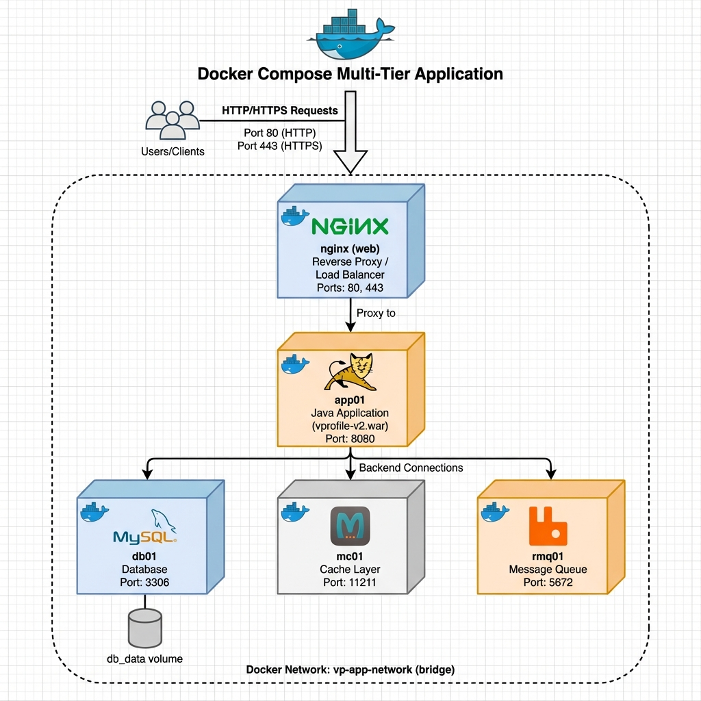
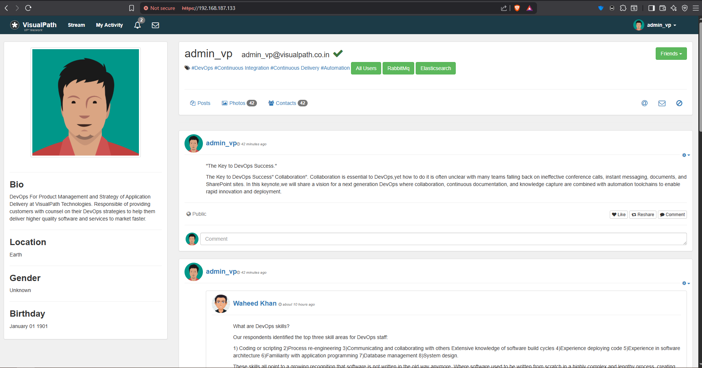
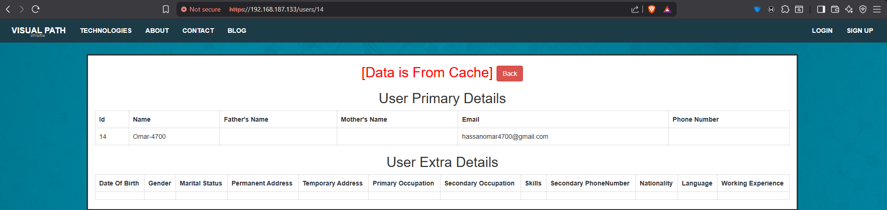
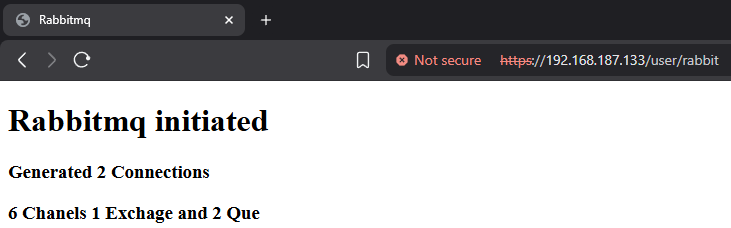

# VP-App Docker Multi-Tier Application

A complete multi-tier web application stack running on Docker, featuring Nginx as a reverse proxy, Tomcat for the Java application, MySQL database, Memcached for caching, and RabbitMQ for message queuing.

## Table of Contents

- [Architecture](#architecture)
- [Services](#services)
- [Prerequisites](#prerequisites)
- [Quick Start](#quick-start)
- [Project Structure](#project-structure)
- [Configuration](#configuration)
- [Port Mappings](#port-mappings)
- [Environment Variables](#environment-variables)
- [Volumes](#volumes)
- [Networking](#networking)
- [Verification](#verification)
- [Troubleshooting](#troubleshooting)

## Architecture

This application follows a multi-tier architecture pattern:



*Complete architecture diagram showing the request flow from users through NGINX reverse proxy to the Tomcat application server and backend services (MySQL, Memcached, RabbitMQ), all running as Docker containers connected via the vp-app-network bridge network.*

**Flow Overview:**

```
Users/Clients (HTTP/HTTPS)
        ↓
Nginx (Reverse Proxy/Load Balancer) - Ports 80, 443
        ↓
Tomcat (Java Application) - Port 8080
        ↓
├── MySQL (Database) - Port 3306
├── Memcached (Cache) - Port 11211
└── RabbitMQ (Message Queue) - Port 5672
```

## Services

### 1. **Nginx** (`web`)
- **Image**: Custom-built from `nginx:latest`
- **Purpose**: Reverse proxy and SSL termination
- **Features**:
  - HTTP (port 80) and HTTPS (port 443) support
  - Auto-generated SSL certificates
  - Custom configuration for the VP application
  - Load balancing to Tomcat application server

### 2. **Tomcat Application** (`app01`)
- **Image**: Custom-built using multi-stage build
- **Base Images**: 
  - Build stage: `maven:3.8.4-openjdk-11`
  - Runtime stage: `tomcat:9.0.75-jdk11`
- **Purpose**: Java web application server
- **Features**:
  - Builds application from source (GitHub repository)
  - Deploys vprofile-v2 application
  - Custom application properties configuration

### 3. **MySQL Database** (`db01`)
- **Image**: Custom-built from `mysql:8.0.44`
- **Purpose**: Relational database
- **Features**:
  - Pre-configured with `accounts` database
  - Automatic database initialization from backup
  - Persistent data storage

### 4. **Memcached** (`mc01`)
- **Image**: Official `memcached` image
- **Purpose**: In-memory caching layer
- **Features**: High-performance distributed memory caching

### 5. **RabbitMQ** (`rmq01`)
- **Image**: Official `rabbitmq` image
- **Purpose**: Message broker for asynchronous communication
- **Features**: AMQP protocol support with default guest credentials

## Prerequisites

- Docker Engine 20.10+
- Docker Compose 1.29+ (or Docker Compose V2)
- At least 4GB of available RAM
- 10GB of free disk space

## Quick Start

1. **Clone the repository** (if not already done):
   ```bash
   git clone -b docker-app https://github.com/Omarh4700/Workshop.git
   cd Workshop/
   ```

2. **Build and start all services**:
   ```bash
   docker-compose up -d
   ```

3. **Verify all containers are running**:
   ```bash
   docker-compose ps
   ```

4. **Access the application**:
   - HTTP: `http://localhost`
   - HTTPS: `https://localhost`
   - Direct Tomcat access: `http://localhost:8080`

5. **Stop all services**:
   ```bash
   docker-compose down
   ```

6. **Stop and remove volumes** (This will delete database data):
   ```bash
   docker-compose down -v
   ```

## Project Structure

```
docker-app/
├── docker-compose.yml          # Main orchestration file
├── nginx/
│   ├── Dockerfile              # Nginx container build instructions
│   ├── vp-app.conf             # Nginx configuration for the app
│   └── generate-ssl.sh         # SSL certificate generation script
├── tom-app/
│   ├── Dockerfile              # Tomcat application build instructions
│   └── application.properties  # Application configuration
├── db/
    ├── Dockerfile              # MySQL container build instructions
    └── db_backup.sql           # Database initialization script

```

## Configuration

### Nginx Configuration

The Nginx service is configured to:
- Listen on ports 80 (HTTP) and 443 (HTTPS)
- Proxy requests to the Tomcat application server
- Handle SSL/TLS encryption
- Custom configuration in `nginx/vp-app.conf`

### Application Configuration

The Tomcat application uses custom properties defined in `tom-app/application.properties` for:
- Database connection settings
- Memcached configuration
- RabbitMQ connection details

### Database Configuration

MySQL is initialized with:
- Database: `accounts`
- User: `admin`
- Password: `admin123`
- Root password: `admin123`
- Initial data from `db/db_backup.sql`

## Port Mappings

| Service    | Container Port | Host Port | Protocol |
|------------|---------------|-----------|----------|
| Nginx      | 80            | 80        | HTTP     |
| Nginx      | 443           | 443       | HTTPS    |
| Tomcat     | 8080          | 8080      | HTTP     |
| MySQL      | 3306          | 3306      | TCP      |
| Memcached  | 11211         | 11211     | TCP      |
| RabbitMQ   | 5672          | 5672      | AMQP     |

## Environment Variables

### MySQL (`db01`)
```yaml
MYSQL_ROOT_PASSWORD: admin123
MYSQL_USER: admin
MYSQL_DATABASE: accounts
```

### RabbitMQ (`rmq01`)
```yaml
RABBITMQ_DEFAULT_USER: guest
RABBITMQ_DEFAULT_PASS: guest
```

## Volumes

- **db_data**: Persistent storage for MySQL database files
  - Mount point: `/var/lib/mysql`
  - Ensures data persistence across container restarts

## Networking

All services are connected via a custom bridge network: `vp-app-network`

This allows:
- Service discovery by container name
- Isolated network communication
- Secure inter-service communication

### Service Dependencies

```
nginx → app01 → db01
              → mc01
              → rmq01
```

## Verification

After deploying the application, you can verify that all services are working correctly by checking the following:

### 1. Application Welcome Page

Access the application through your browser at `http://localhost` or `https://localhost`. You should see the VP-App welcome page indicating successful deployment.

**Screenshot:**



*The welcome page confirms that Nginx is properly proxying requests to the Tomcat application server.*

### 2. Memcached Validation

The application should successfully connect to Memcached for caching. You can verify this by observing the caching behavior:

#### 2.1 Data From DB and Inserted Into Cache

On the first request, data is fetched from the MySQL database and then stored in Memcached for future requests.

**Screenshot:**


*This shows the initial request where data is retrieved from the database and inserted into Memcached (mc01) cache.*

#### 2.2 Data Served From Cache

Subsequent requests for the same data are served directly from Memcached, improving performance significantly.

**Screenshot:**



*This demonstrates that data is being served from Memcached cache, reducing database load and improving response time.*

### 3. RabbitMQ Validation

Verify that RabbitMQ is running and the application can connect to the message broker.

**Screenshot:**



*This confirms that RabbitMQ (rmq01) is operational and the application can communicate with the message queue.*

### Additional Verification Commands

You can also verify the services using Docker commands:

```bash
# Check all containers are running
docker-compose ps

# Verify Memcached is responding
echo "stats" | nc localhost 11211

# Check RabbitMQ status
docker exec -it rmq01 rabbitmqctl status

# Test database connection
docker exec -it db01 mysql -uadmin -padmin123 -e "SHOW DATABASES;"

# Check Nginx is serving content
curl -I http://localhost
```

**Expected Output:**
- All containers should show status as "Up"
- Memcached should return statistics
- RabbitMQ should show running status
- MySQL should list the `accounts` database
- Nginx should return HTTP 200 or 302 response

## Troubleshooting

### Check container logs
```bash
# All services
docker-compose logs

# Specific service
docker-compose logs nginx
docker-compose logs app01
docker-compose logs db01
```

### Rebuild a specific service
```bash
docker-compose up -d --build nginx
```

### Access container shell
```bash
docker exec -it web bash        # Nginx
docker exec -it app01 bash      # Tomcat
docker exec -it db01 bash       # MySQL
```

### Common Issues

1. **Port already in use**: Ensure ports 80, 443, 3306, 8080, 11211, and 5672 are not in use by other services
2. **Database connection errors**: Wait for MySQL to fully initialize (can take 30-60 seconds on first run)
3. **SSL certificate errors**: The self-signed certificate will show warnings in browsers - this is expected for development

## Notes

- The application source code is cloned from GitHub during the build process
- SSL certificates are self-signed and generated during the Nginx container build
- The MySQL database is initialized with data from `db_backup.sql` on first run
- All services use a custom bridge network for secure communication

## Development

To make changes:

1. Modify the relevant Dockerfile or configuration files
2. Rebuild the affected service:
   ```bash
   docker-compose up -d --build <service-name>
   ```
3. Check logs for any issues:
   ```bash
   docker-compose logs -f <service-name>
   ```

---

**Built with Docker** 
